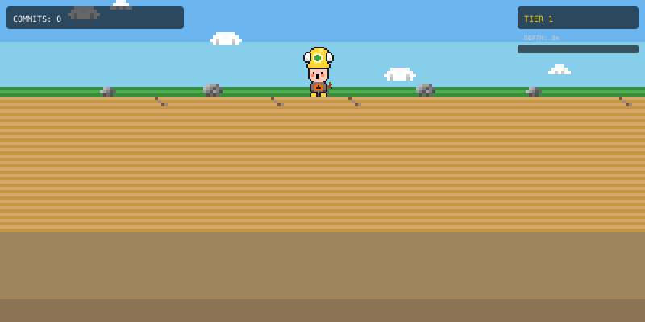
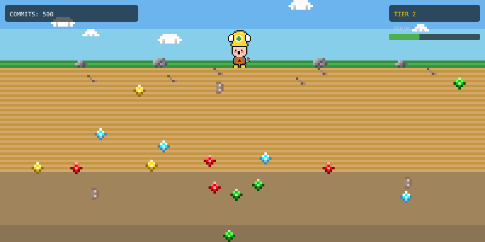
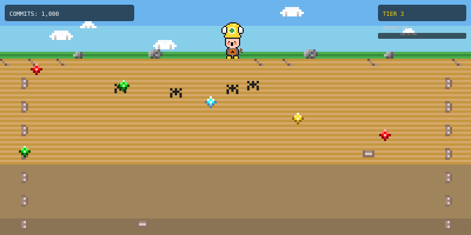
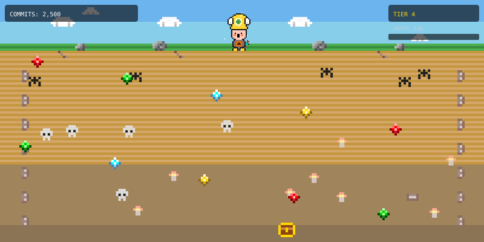
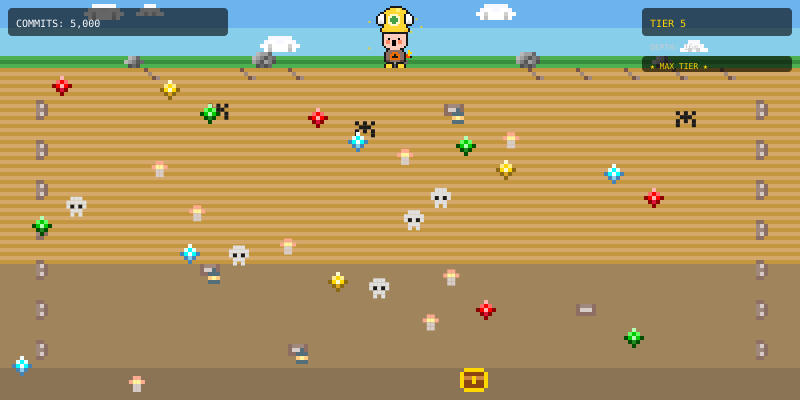

# GitHub Miner

A pixel art miner inspired by 굴착소년 쿵 (Under Attack) that evolves based on your GitHub commit activity.


## How It Works

A Node.js script fetches your GitHub contribution data and generates a pixel art SVG featuring:
- An orange-bodied miner standing on green grass with clouds drifting overhead
- Sandy underground that deepens as you make more commits
- Gray boulders scattered along the surface
- Pickaxe upgrades through 5 tiers
- Gems and resources accumulating underground
- A game-style HUD showing your commit count, current tier, depth, and progress toward the next tier

Updated automatically every 6 hours via GitHub Actions.

## Setup

1. Create a GitHub Personal Access Token with `read:user` scope
2. Add it as a repository secret named `GH_TOKEN`
3. The GitHub Actions workflow handles the rest

## Easy Setup with Claude Code

If you use [Claude Code](https://claude.com/claude-code), just run:

```
/project:setup
```

Claude will walk you through every step — no technical knowledge needed!

## Local Development

```bash
export GITHUB_USERNAME=your-username
export GH_TOKEN=your-token
node src/index.js
```

## Tier Gallery

| Tier | Commits | Description | Preview |
|------|---------|-------------|---------|
| **1** | 0+ | **Surface Mine:** Just breaking ground. Roots visible near the surface. Wooden pickaxe. |  |
| **2** | 250+ | **Shallow Mine:** Digging deeper. Vertical wooden supports appear. Iron pickaxe. Some gems. |  |
| **3** | 1,000+ | **Deep Mine:** Established shaft. Horizontal beams and lanterns light the way. Steel pickaxe. Gold and gems. |  |
| **4** | 2,500+ | **Very Deep Mine:** Magical depths. Glowing mushrooms and complex structures. Diamond pickaxe. Abundant resources. |  |
| **5** | 5,000+ | **Massive Cavern:** The motherlode. Legendary gear and a hoard of treasure. |  |
