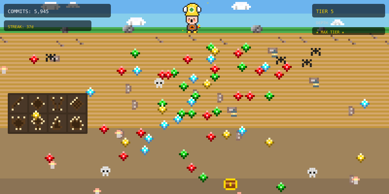

# GitHub Miner

A pixel art miner that evolves based on your GitHub commit activity.



## How It Works

A Node.js script fetches your GitHub contribution data and generates a pixel art SVG where:
- The mine gets deeper as you make more commits
- Your pickaxe upgrades through 5 tiers
- Gems and resources accumulate underground

Updated automatically every 6 hours via GitHub Actions.

## Setup

1. Create a GitHub Personal Access Token with `read:user` scope
2. Add it as a repository secret named `GH_TOKEN`
3. The GitHub Actions workflow handles the rest

## Local Development

```bash
export GITHUB_USERNAME=your-username
export GH_TOKEN=your-token
node src/index.js
```

## Tiers

| Tier | Commits | Scene |
|------|---------|-------|
| 1 | 0-499 | Surface mine, wooden pickaxe |
| 2 | 500-1999 | Shallow mine, iron pickaxe, few gems |
| 3 | 2000-4999 | Deep mine, steel pickaxe, gems and gold |
| 4 | 5000-9999 | Very deep mine, diamond pickaxe, abundant resources |
| 5 | 10000+ | Massive cavern, legendary gear, treasure hoard |
