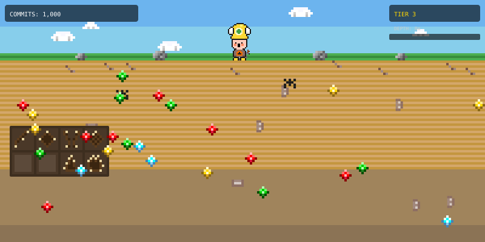
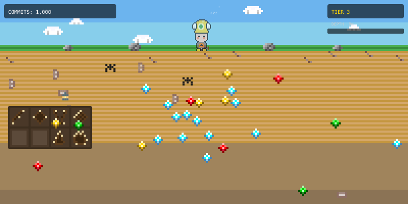

# GitHub Miner

[English](README.md) | **한국어**

굴착소년 쿵에서 영감을 받은 픽셀 아트 광부로, GitHub 커밋 활동에 따라 진화합니다.


## 작동 방식

Node.js 스크립트가 GitHub 기여 데이터를 가져와 다음과 같은 픽셀 아트 SVG를 생성합니다:
- 초록색 잔디 위에 서 있는 주황색 광부와 하늘에 떠다니는 구름
- 커밋이 많아질수록 깊어지는 모래 지하층
- 지표면을 따라 흩어진 회색 바위
- 5단계에 걸친 곡괭이 업그레이드
- 지하에 축적되는 보석과 자원
- 커밋 수, 현재 티어, 깊이, 다음 티어까지의 진행도를 보여주는 게임 스타일 HUD

GitHub Actions를 통해 6시간마다 자동 업데이트됩니다.

## 설정

1. `read:user` 스코프로 GitHub Personal Access Token을 생성합니다
2. 리포지토리 시크릿에 `GH_TOKEN`이라는 이름으로 추가합니다
3. GitHub Actions 워크플로우가 나머지를 처리합니다

## Claude Code로 설정하기

[Claude Code](https://claude.com/claude-code)를 사용하신다면, 아래 프롬프트를 복사해서 터미널에 붙여넣기만 하면 됩니다. GitHub을 처음 써보셔도 괜찮습니다 — Claude가 모든 과정을 안내해 줍니다.

<details>
<summary>이 프롬프트를 복사하세요</summary>

```
Set up GitHub Miner on my profile. Handle everything autonomously. Explain each step in plain language and only ask me when browser action is required.

IMPORTANT RULES:
- After each step, tell me what you just did in simple, friendly language.
- If any step fails, provide a browser-based fallback with click-by-click instructions.
- Never show my token value in messages after storing it.

PHASE 0 — PREREQUISITES:

0-1. Check if gh CLI is installed: `gh --version`
     If NOT installed, tell me:
       "First, we need to install the GitHub CLI tool. Please run this in your terminal:"
       - macOS: `brew install gh`
       - Windows: `winget install --id GitHub.cli`
       - Linux: see https://github.com/cli/cli/blob/trunk/docs/install_linux.md
     Wait for me to confirm, then re-check.

0-2. Check if gh is authenticated: `gh auth status`
     If NOT authenticated, tell me:
       "I need to connect your terminal to GitHub. I'll run a command that will:"
       "1) Show a one-time code  2) Open your browser  3) Ask you to paste the code and click Authorize"
     Then run: `gh auth login --web --git-protocol https`
     Wait for completion, then verify with `gh auth status`.

0-3. Extract my username: `gh api user --jq '.login'` → store as {me}.

PHASE 1 — GET THE REPOSITORY:

1-1. Check if I already have it: `gh repo view {me}/github-graphic --json name 2>&1`
     If exists → skip to Phase 2.

1-2. Fork: `gh repo fork tmdgusya/github-graphic --clone=false --remote=false`
     Verify: `gh repo view {me}/github-graphic --json name,url`
     If fork fails, tell me to open https://github.com/tmdgusya/github-graphic/fork and click "Create fork".

1-3. Enable Actions: `gh api -X PUT repos/{me}/github-graphic/actions/permissions -f enabled=true -f allowed_actions=all`
     If fails, tell me to open https://github.com/{me}/github-graphic/actions and click the green enable button.

PHASE 2 — CREATE A SECURITY TOKEN:

Tell me:
  "Now I need you to create an access key so the miner can read your GitHub activity."
  "Please open this link: https://github.com/settings/tokens/new?scopes=read:user&description=github-miner"
  ""
  "On that page:"
  "1. 'Note' field → should already say 'github-miner' (don't change it)"
  "2. 'Expiration' dropdown → select 'No expiration' so your miner never stops"
  "3. 'Select scopes' → 'read:user' should already be checked (don't check anything else)"
  "4. Scroll down → click the green 'Generate token' button"
  "5. You'll see a code starting with ghp_ → copy it immediately (GitHub won't show it again!)"
  "6. Paste it here"

When I provide the token:
- Validate it starts with `ghp_` and is 30+ characters. If not, ask me to try again.
- Verify it works: `gh api -H "Authorization: token {token}" user --jq '.login'`
- If 401 error, tell me the token might be wrong and ask to recreate it.

PHASE 3 — STORE THE TOKEN:

3-1. `gh secret set GH_TOKEN --repo {me}/github-graphic --body "{token}"`
3-2. Verify: `gh secret list --repo {me}/github-graphic` → should show GH_TOKEN.
     If fails, guide me to https://github.com/{me}/github-graphic/settings/secrets/actions/new
     with Name: GH_TOKEN and Secret: the token I pasted.

PHASE 4 — SET UP PROFILE PAGE:

4-1. Check if profile repo exists: `gh repo view {me}/{me} --json name 2>&1`
     If not, create it: `gh repo create {me}/{me} --public --add-readme --description "My GitHub profile"`
     If creation fails, guide me to https://github.com/new with repository name = my username.

4-2. Detect branches:
     `gh repo view {me}/github-graphic --json defaultBranchRef --jq '.defaultBranchRef.name'` → {branch}
     `gh repo view {me}/{me} --json defaultBranchRef --jq '.defaultBranchRef.name'` → {profile_branch}

4-3. Check if miner is already embedded:
     `gh api repos/{me}/{me}/contents/README.md --jq '.content' | base64 --decode 2>/dev/null`
     If it contains "github-miner.svg" → skip to Phase 5.

4-4. Clone profile repo to /tmp, read existing README.md, and APPEND (do NOT replace existing content):

---

<a href="https://github.com/{me}/github-graphic">
  
</a>

<sub>⛏️ This pixel art miner evolves as I commit code. <a href="https://github.com/tmdgusya/github-graphic">Get your own!</a></sub>

     Commit, push, and clean up the temp clone.

PHASE 5 — START THE MINER:

5-1. `gh workflow run generate.yml --repo {me}/github-graphic`
5-2. Wait ~30s, then poll: `gh run list --repo {me}/github-graphic --limit 1 --json status,conclusion,databaseId`
     If in_progress, wait and re-check. If failed, show logs with `gh run view {id} --repo {me}/github-graphic --log-failed`.
5-3. Verify SVG: `curl -s -o /dev/null -w "%{http_code}" "https://raw.githubusercontent.com/{me}/github-graphic/{branch}/github-miner.svg"` → expect 200.

PHASE 6 — DONE!

Tell me: "Your GitHub Miner is live! Open https://github.com/{me} to see it. It updates every 6 hours automatically. The more you commit, the deeper your mine gets!"
```

</details>

## 로컬 개발

```bash
export GITHUB_USERNAME=your-username
export GH_TOKEN=your-token
node src/index.js
```

## 게이미피케이션 기능

광부가 GitHub 활동에 실시간으로 반응합니다. 모든 데이터는 기존 기여 캘린더 API에서 계산되므로 추가 API 호출이 필요하지 않습니다.

### 스트릭 HUD

COMMITS 카운터 아래에 현재 연속 커밋 스트릭을 표시합니다.

| 스트릭 | 시각 효과 |
|--------|-----------|
| 0일 | 숨김 |
| 1–6일 | `STREAK: 3d` 흰색 표시 |
| 7–29일 | `STREAK: 14d` 금색 표시 |
| 30일 이상 | `STREAK: 45d` 금색 + 펄스 애니메이션 |

### 광부 상태

최근 활동에 따라 광부의 외형이 변합니다.

| 상태 | 조건 | 시각 효과 | 미리보기 |
|------|------|-----------|----------|
| **활동 중** | 오늘 커밋함 | 곡괭이 스윙 (–40° 회전, 1.2초 주기). 애니메 스타일의 스우시 아크가 다운스트로크에서 번쩍임. 충격 시 스파크 파티클 발생. |  |
| **보통** | 마지막 커밋 1–6일 전 | 기본 정적 포즈. 애니메이션 없음. |  |
| **대기** | 7일 이상 커밋 없음 | 감은 눈, 바닥에 놓인 곡괭이, 낮은 불투명도 (65%), 떠다니는 "zzz" 텍스트 + 펄스. |  |

### 업적 벽감

좌측 지하벽에 새겨진 돌 패널에 획득한 마일스톤이 4×2 그리드로 표시됩니다. 획득한 슬롯은 새겨진 아이콘을, 미획득 슬롯은 빈 어두운 돌을 보여줍니다.

| 슬롯 | 마일스톤 | 아이콘 | 조건 |
|------|----------|--------|------|
| 1 | 첫 걸음 | 곡괭이 | 기여 50회 이상 |
| 2 | 센추리 | 별 | 기여 100회 이상 |
| 3 | 헌신 | 이중 곡괭이 | 기여 500회 이상 |
| 4 | 베테랑 | 다이아몬드 | 기여 1,000회 이상 |
| 5 | 마스터 | 왕관 | 기여 2,500회 이상 |
| 6 | 레전드 | 트로피 | 기여 5,000회 이상 |
| 7 | 스트릭 시작 | 작은 불꽃 | 최장 스트릭 7일 이상 |
| 8 | 스트릭 마스터 | 큰 불꽃 | 최장 스트릭 30일 이상 |

### 곡괭이 스윙 상세

광부가 **활동 중** 상태일 때, 곡괭이 애니메이션은 세 가지 레이어로 구성됩니다:

1. **스윙** — 곡괭이 픽셀(손잡이 + 머리)이 그립 포인트를 중심으로 SVG `<animateTransform>`을 사용해 –40° 회전합니다. 자연스러운 호를 위해 cubic-bezier 이징이 적용됩니다.
2. **스우시 아크** — 반지름 10/14/18px의 세 개 흰색 속도선이 스윙 경로를 그립니다. 불투명도가 **다운스트로크**에 동기화됩니다 (업스윙 시 투명, 다운스윙 시 번쩍임).
3. **충격 스파크** — 여섯 개의 색상 파티클 (#FFD700, #FF6B35, #FFA500, #FFFFFF)이 곡괭이 머리 근처에서 터지며, 역시 다운스트로크에 맞춰 타이밍됩니다.

## 티어 갤러리

| 티어 | 커밋 | 설명 | 미리보기 |
|------|------|------|----------|
| **1** | 0+ | **지표면 광산:** 막 땅을 파기 시작합니다. 지표면 근처에 뿌리가 보입니다. 나무 곡괭이. |  |
| **2** | 250+ | **얕은 광산:** 더 깊이 파고 들어갑니다. 수직 나무 지지대가 나타납니다. 철 곡괭이. 일부 보석. |  |
| **3** | 1,000+ | **깊은 광산:** 확립된 갱도. 수평 보와 랜턴이 길을 밝힙니다. 강철 곡괭이. 금과 보석. |  |
| **4** | 2,500+ | **매우 깊은 광산:** 마법의 깊이. 빛나는 버섯과 복잡한 구조물. 다이아몬드 곡괭이. 풍부한 자원. |  |
| **5** | 5,000+ | **거대한 동굴:** 대광맥. 전설적인 장비와 보물 더미. |  |
